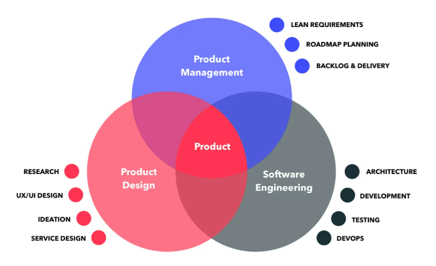
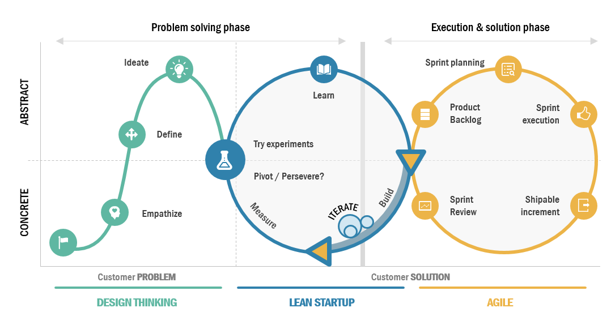
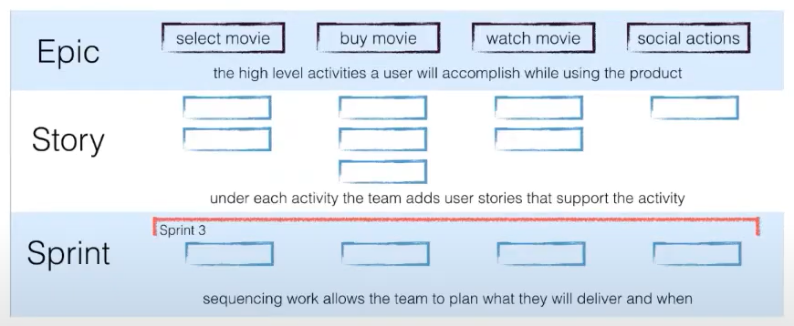

**Role of a Product Manager**  
-- The product manager and project manager role are becoming the same as all businesses are becoming technology businesses.  
-- A PM's role is to bridge the gap between customers, the business and the technology/development/design teams.  
-- Talking to users and understanding their behaviours (many times irrational behaviours) is core part of the job.  

**Typical Product Team**  

  

**The LEAN Method**  
- Design thinking + Lean startup + Agile  

  

- You can't tell what the market will respond to  
- You need to ask the users themselves, and then see what works and what doesn't. Be water.  
- Run many experiments, throw out the ones that don't work. Keep the ones that do.
- Measure using Mixpanel or Google Analytics.  
- Build products using **sprints**.  

**Talking to the user**  
-- PM's rarely know what their users or customers want  
-- Users and paying customers are two different. audiences. Paying customers will get technical fast!  
-- Users and customers rarely know what they want before they see it(go with mockups!).  
-- It is best if you have suffered from the problem yourself.  

**Write Stories**  
-- Once you talk to the user, write a story with what they want and what benefit they expect.  
-- Write "Acceptance criteria" so that that user role has some basic requirement to perform that action.  
-- If a lot of users are asking for something, it will usually be true, especially if those users have used competitor products. If you do 300 interviews and only 1 of them asks for a rocketship, don't build a rocketship.  

**Epics**  

  

-- Bundle stories together to form "Epics"  
-- In each sprint, add the new stories and epics to the backlog, so developers and designers can work on it.  
-- Developers and designers rarely work in long stretches, they work in sprints.  
-- An example is: If you are building an app like Netflix, the team builds out the movie player in 2 weeks in a sprint, and then spends the next 2 weeks fixing bugs. **High energy followed by low/medium energy work**.  

**Wireframes**  
-- Wireframes are user stories that are represented visually.  
-- Use tools like https://moqups.com/ and https://www.framer.com/ to create wireframes and mockups.  

**Sprints**  
-- Use tools like https://trello.com/ , a kanban board, to sprint.  
-- Tag user stories as:  
- "High importance"  
- "Medium importance"  
- "Nice to have"  

-- Choose the ones to put in the month's backlog.  

**Communication and daily standups**  
-- Do daily stand-ups so everyone can report what they're working on. This is a 10-min video call followed by a 3 bullet point summary by everyone.  
-- On the standup, everyone mentions what blocker they have, if they have any. A blocker is anything that prevents them from carrying out their tasks.  
-- An example could be "Milan has to send me the mockups so I can design the home page". Tag Milan, so he can respond and fix the issue.  
